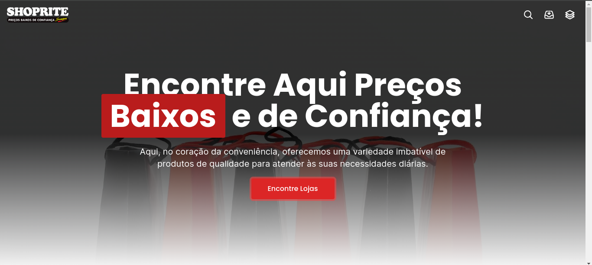
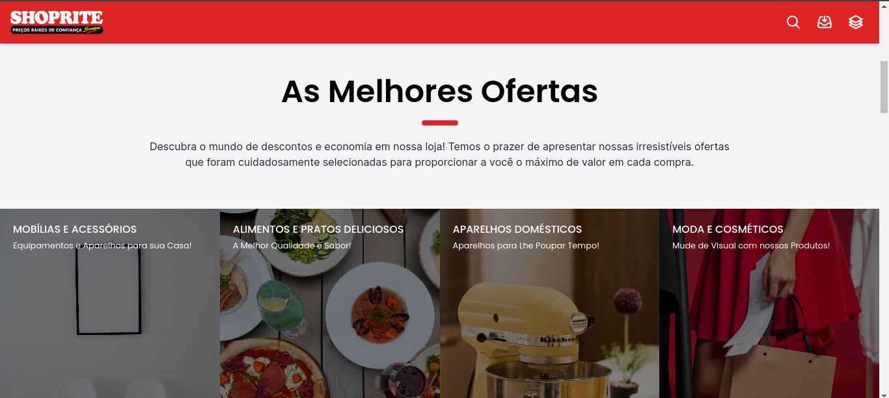
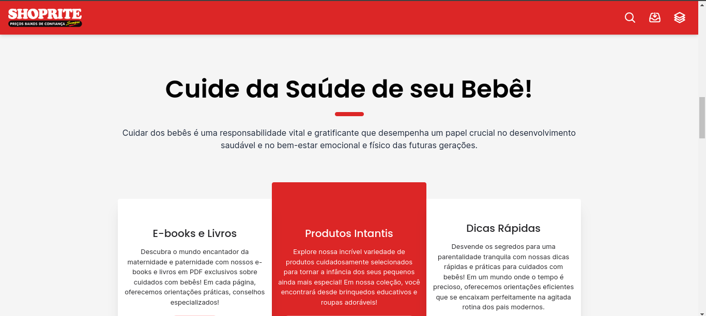
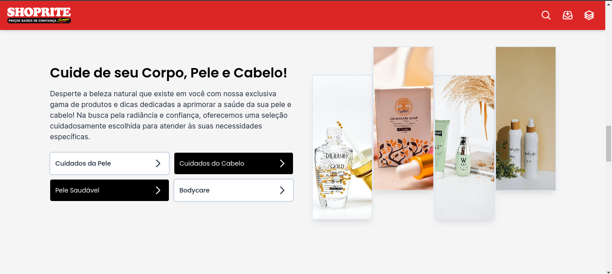
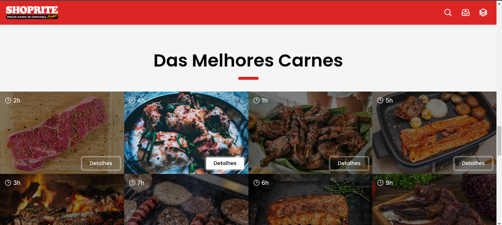
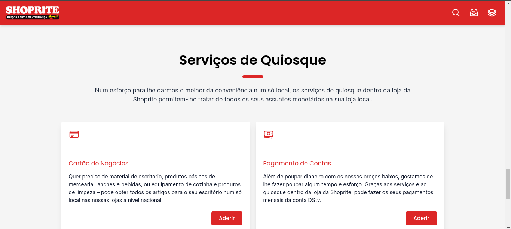
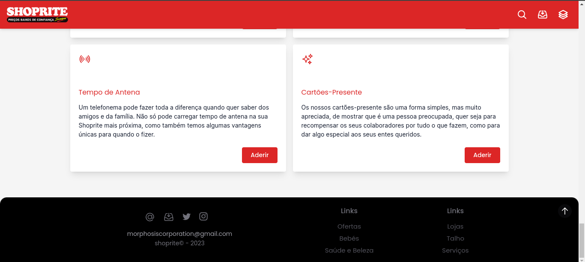
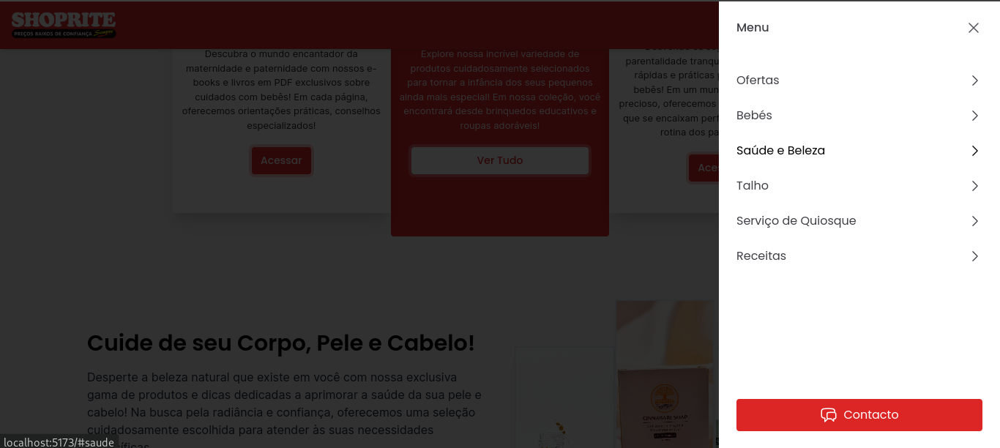
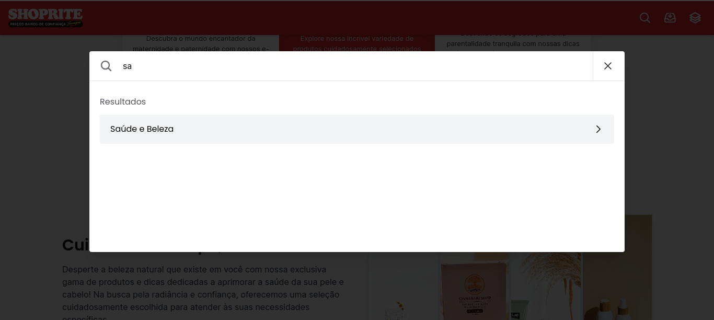

#Shoprite Clone

Este Projecto Front-end é um clone do Site da Shoprite mas do jeito que eu Acho que o Site deveria ser feito, sem Reprovar as ideias atuais de design e funcionamento do Site, apenas por questões didáticas decidi clonar o mesmo.

#Tecnologias
- React.js
- Vite.js
- Tailwind CSS
- Grid e Flexbox

#Imagens

#Links Adicionais
[Vercel Profile](https://vercel.com/mariosalembe23)
[Instagram Profile](https://www.instagram.com/mariosalembe22)
[URL Live](https://vercel.com/mariosalembe23)